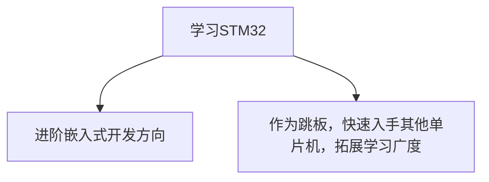

## 考核通知

同学们，大家已经对C语言的语法以及单片机的概念有了一定的了解。本次考核的任务是基于51单片机（**STC89C52RC**）的入门实践。我知道有部分同学已经开始学习**STM32**，因此我们针对有**STM32**基础者提供了**30分**的附加分数。
> **考试分数占比**：  
**51单片机** 两道题，每题50分；**STM32**附加题30分。  
> **考试时间**：  
***国庆假期7天***。题目将在国庆前发布，国庆后进行验收。  
> **考试范围**：  
**51单片机**将涵盖至**DS1302**模块（以江科大视频顺序为参考）；**STM32**内容暂定。

针对一些同学的疑问：“学习STM32应该跟谁学？” 实际上，我们增加附加题的部分是为了照顾那些已提前学习了STM32的同学。你们可以按照自己的学习节奏来进行复习和准备。学习STM32的目标有两个：

因此，即使你选择了STM32，还是可以尝试完成51单片机的考核，挑战自己是否真正掌握了单片机的本质。考核重点包括：理解外设、配置外设、实现功能。

### 学习资料
- **软件安装包、开发板资料、课件及程序源码**下载链接：[江科大下载](https://jiangxiekeji.com/download.html)
- **视频教程**：[哔哩哔哩](https://www.bilibili.com/video/BV1Mb411e7re?vd_source=c777f3e15c824872d6d21929fdacee18)

### 后续发展路径
- **比赛**：  
  [[蓝桥杯-嵌入式]]、嵌入式设计大赛（海思赛道、沁恒赛道、兆易赛道）、物联网大赛、电赛等。

- **技术栈学习**：  
  鉴于大家还处于大二阶段，我们为大家提供了方向建议，具体学习路径由个人选择（初定三个方向）。  

>[!IMPORTANT]
如果有任何疑问，请及时联系组长或副组长，详细说明你的问题，比如难度过高或者你是零基础等。我们会根据大家的具体情况进行解答和帮助。

***希望大家在考核中有所收获，预祝考试顺利！***

# 目前排名
