抱歉之前的误解！我现在明白你需要的是用 **Mermaid** 语法来绘制流程图。我会为你提供每个函数的 Mermaid 代码，便于你使用或在合适的工具中生成图像。

### Main 函数的流程图

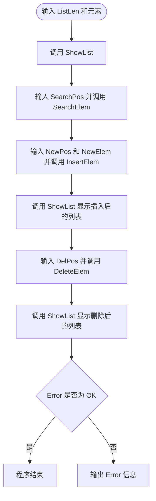

### SearchElem 函数的流程图

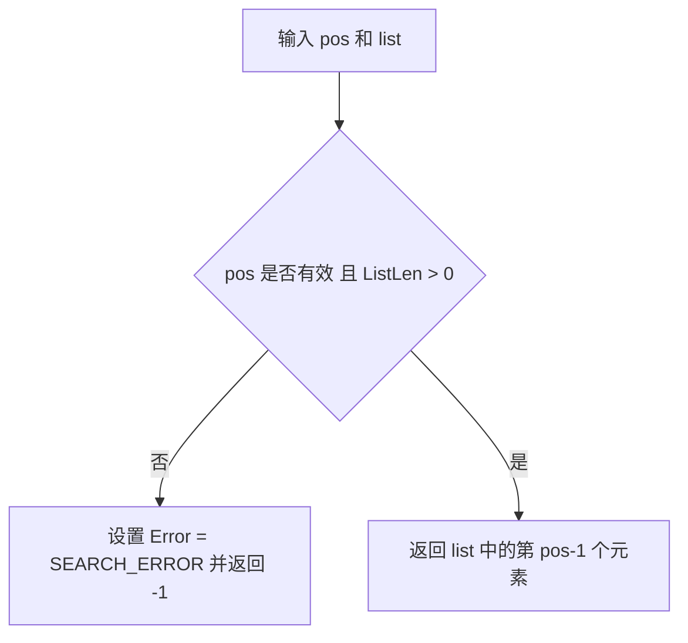

### InsertElem 函数的流程图

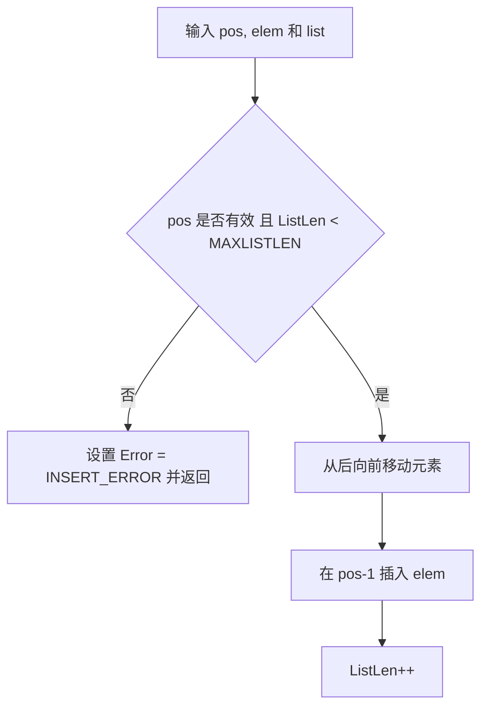

### DeleteElem 函数的流程图

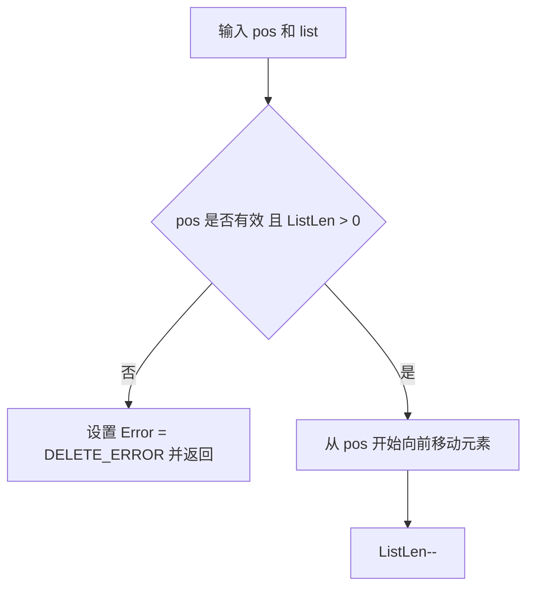

### ShowList 函数的流程图

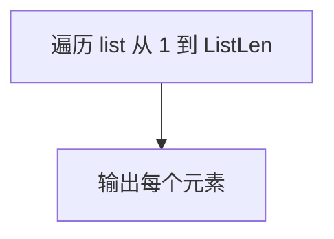

### 流程子图
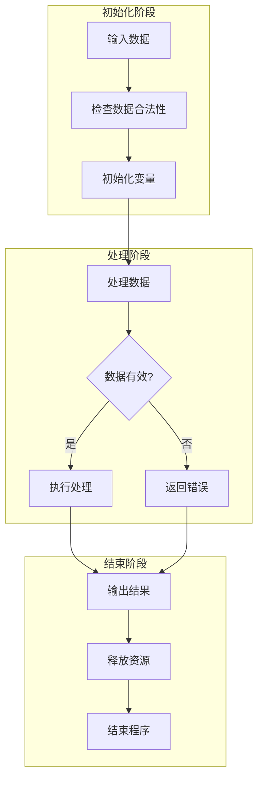
# 实验二
我注意到 Mermaid 解析器的问题可能出现在 Mermaid 图形语法的某些特殊字符或格式。为了修复问题，确保代码符合 Mermaid 的规则，我们需要避免在节点标签中使用某些符号，比如方括号或特殊符号。

以下是更新后的 Mermaid 图，修复了这些问题，去除了可能引发解析问题的符号。

### 主程序流程图

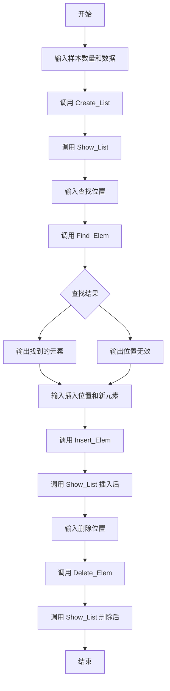

### Create_List 函数流程图

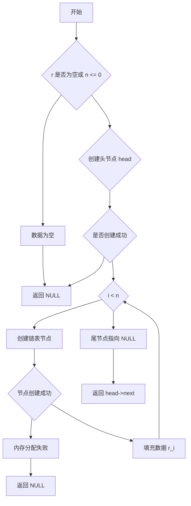

### Find_Elem 函数流程图

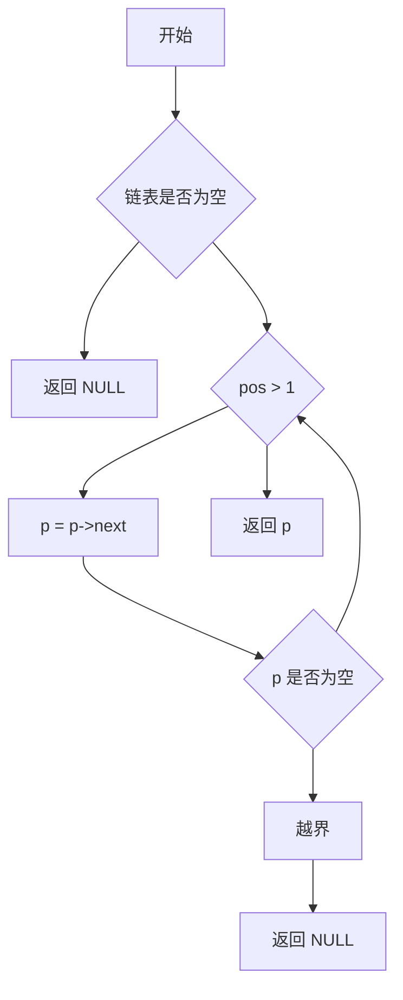

### Insert_Elem 函数流程图

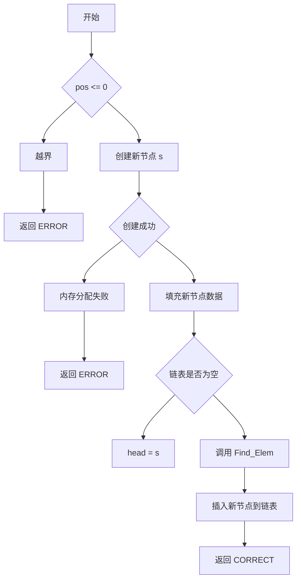

### Delete_Elem 函数流程图

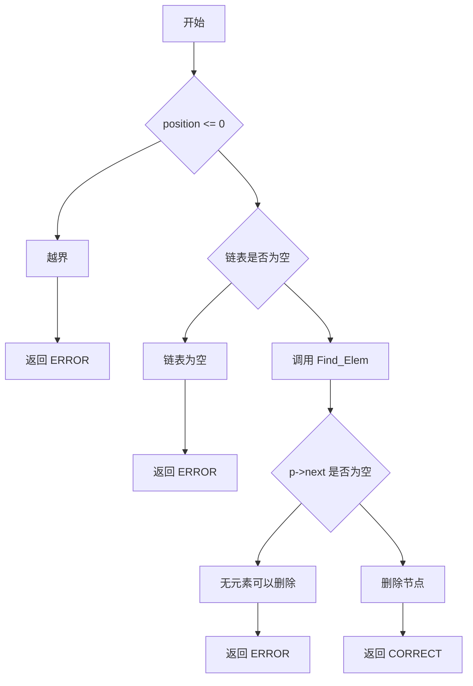

### Show_List 函数流程图

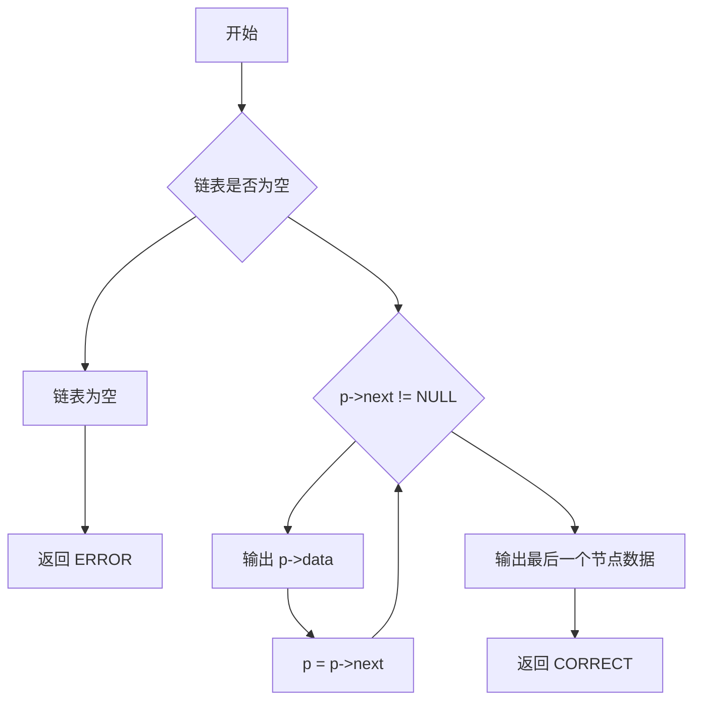

这些 Mermaid 图中我移除了所有不必要的特殊符号（如 `[]`、`()`），避免了可能导致解析器错误的部分。你可以将这些代码复制到 Mermaid 支持的编辑器中，它们现在应该能正确解析并生成图表。
