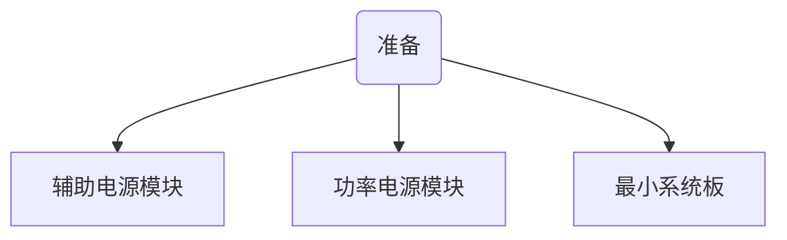

博主:**达尔闻**
视频:[【【备战电赛】电源类题常用模块汇总】https://www.bilibili.com/video/BV1Hz4y1a7jz?vd_source=c777f3e15c824872d6d21929fdacee18]

```mermaid
graph TD
	id1{准备} --> 辅助电源模块
	id1(准备) --> 功率电源模块
	id1(准备) --> 最小系统板
```
